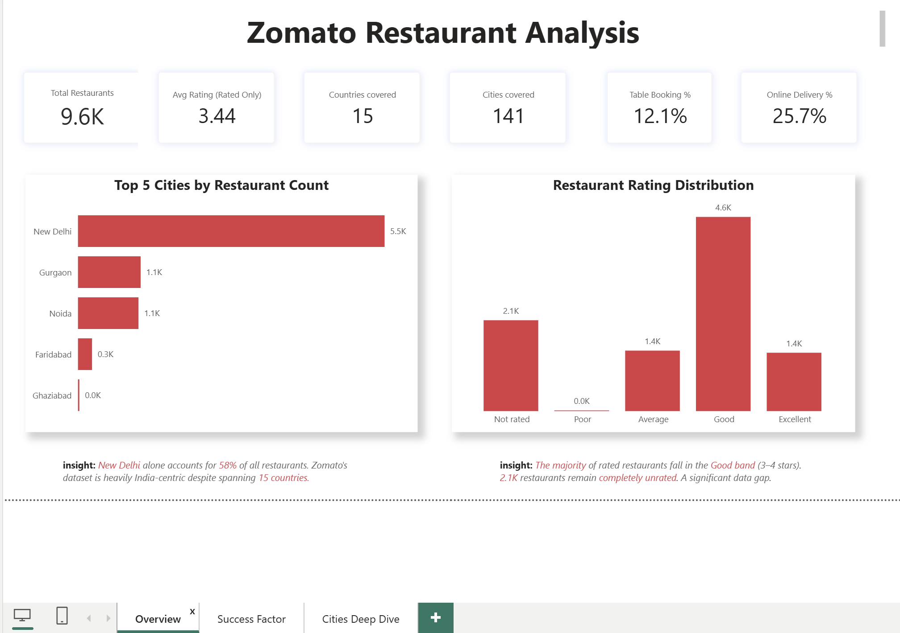
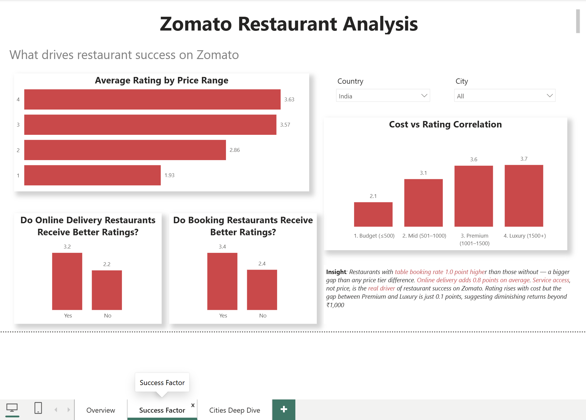
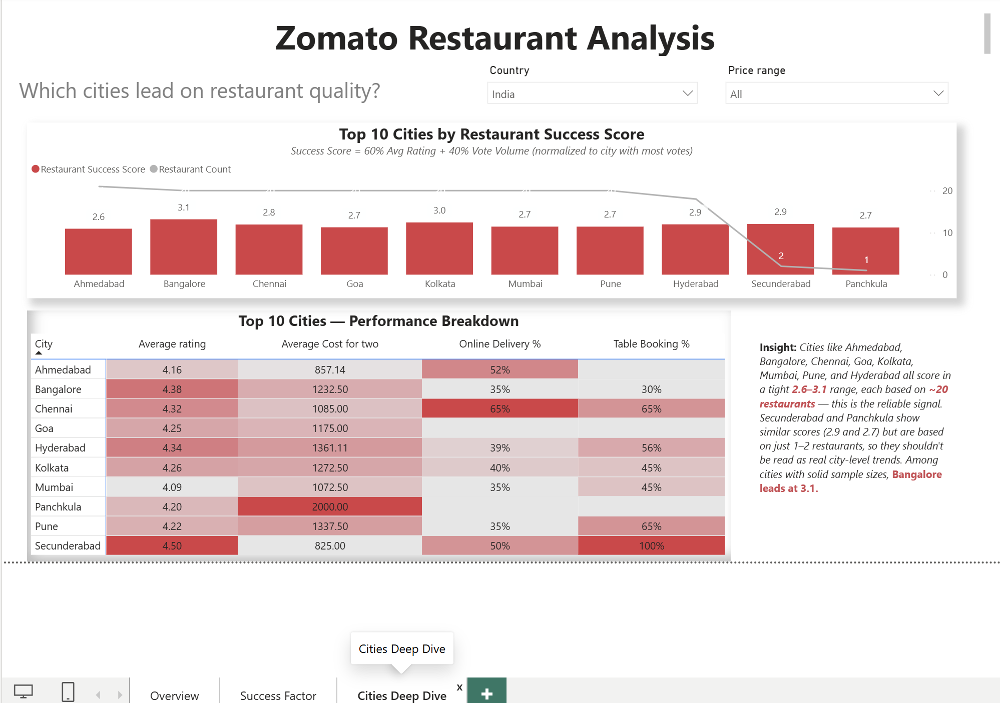

# Zomato Restaurant Analysis — Power BI Dashboard

An interactive Power BI dashboard analyzing ~9,600 restaurants across 15 countries 
(141 cities) on Zomato, exploring what actually drives restaurant success — rating, 
price, delivery, and table booking — through hypothesis testing and a custom 
weighted success score.

---

## What's inside

### Page 1: Overview
High-level view of the dataset — total restaurants, average rating, rating 
distribution, and city coverage. New Delhi alone accounts for 58% of all restaurants, 
confirming the dataset is heavily India-centric despite spanning 15 countries.

### Page 2: Success Factors
Tests whether online delivery and table booking actually correlate with better 
ratings — they do. Table booking shows a 1.0-point rating gap (bigger than any price 
tier difference), and online delivery adds ~0.8 points on average. Also shows 
diminishing returns on price: the rating gap between Premium and Luxury restaurants 
is just 0.1 points.

### Page 3: Cities Deep Dive
Ranks the top 10 cities by a custom **Restaurant Success Score** (60% average rating 
+ 40% normalized vote volume), cross-referenced against restaurant count per city to 
flag small-sample cities that would otherwise skew the ranking.

---

## Key technical work

- **Custom DAX measure — Restaurant Success Score:** a weighted metric combining 
  average rating (60%) and vote volume normalized against the city with the highest 
  vote count (40%). Caught and fixed a normalization bug where `MAXX` was 
  inadvertently computing an average instead of a true maximum, which was inflating 
  scores for cities with above-average vote counts.
- **Small-sample flagging:** cross-referenced Success Score against restaurant count 
  per city using a dual-axis line-and-column chart, surfacing that some high-scoring 
  cities (e.g. Secunderabad, Panchkula) were based on just 1–2 restaurants — a 
  misleading signal if left unadjusted.
- **Blank-vs-zero handling:** fixed a common Power BI pitfall where `DIVIDE()`'s 
  zero-fallback doesn't trigger when the *numerator* (not denominator) evaluates to 
  `BLANK()` — required switching from `CALCULATE(COUNT(...))` to 
  `COUNTROWS(FILTER(...))` to guarantee real zero values instead of blank cells.
- **Hypothesis-driven analysis:** built the Success Factors page around explicit 
  yes/no comparisons (does online delivery correlate with rating? does table 
  booking?) rather than just descriptive charts.

## Tech stack

Power BI Desktop · DAX · Power Query

## Data source

[Zomato Restaurants dataset](https://www.kaggle.com/datasets/shrutimehta/zomato-restaurants-data/data)(Kaggle) — ~9,600 restaurants, 15 countries, 
141 cities.

---

**[LinkedIn](https://linkedin.com/in/khushi-khandelwal04)** · 
**[More projects](https://github.com/khushikhandelwal04)**
